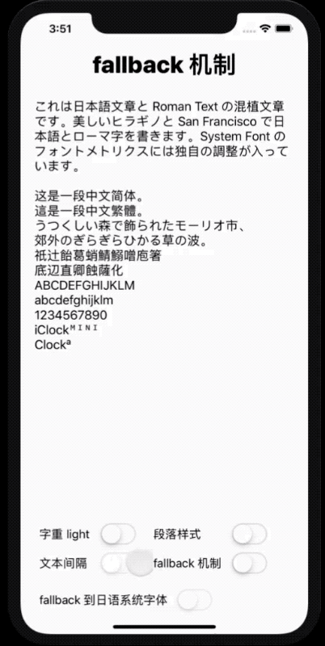

[](https://travis-ci.org/pcjbird/fbCharm)
[](http://cocoadocs.org/docsets/fbCharm/)
[](http://cocoadocs.org/docsets/fbCharm/)
[](https://www.apache.org/licenses/LICENSE-2.0.html)
[](https://github.com/pcjbird/fbCharm)
[](https://github.com/pcjbird/fbCharm/releases)
[](https://github.com/pcjbird/fbCharm/releases)
[](https://pcjbird.github.io)

# fbCharm (Charm of Fallback)
### iOS 上利用 fallback 机制为不同语言的文字 (script) 设定字体，从而使得文本混排更为优雅。

如果您是一位 WEB 开发者，相信您对 CSS 的 font-family 属性一定不会陌生。通常我们会为 font-family 属性设置一长串的字体(家族)列表，就像这样的：

```css
.text { font-family: Menlo, Monaco, Consolas, "Courier New", monospace, Arial, "Microsoft YaHei", "黑体", "宋体", sans-serif; }
```

有人肯定会问，为什么要这么设置啊？如果你足够细心，你一定会发现当你浏览该网页时英文字体和中文字体并不是同一种字体，如果你在不同的操作系统甚至不同的电脑上看到网页所呈现的字体也不一样。这又是为什么呢？

此外，在您使用 Microsoft Word 进行段落排版的时候，你会发现 Word 可以自动对中文样式应用中文字体，对英文样式应用英文字体。这又是如何做到的呢？

在实际的排版需求中，为了好看，我们通常会需要针对不同语言的文字 (script) 进行不同的字体设定，以达到最佳的视觉效果。当然，对于我们来说，最常见的还是中英文混排。通常设计人员给出的设计稿非常漂亮，可是中英文使用了不同的字体，我们开发人员该如何高保真地还原设计稿的原始设计呢？

很显然，对于 WEB 开发者来说，已经有了很好的解决方案，而对于其他客户端的同学来说，这估计应该就有点犯难了，我们通常会告诉设计人员：“系统不支持” 抑或 “做不了” 之类的话。那事实上，到底能不能做到呢？答案是肯定的。

## 特性 / Features

1. 支持类似 CSS 的 font-family 属性一样设置一个字体家族 (font-family) 列表或字体名称 (font-name) 列表从而创建一个混合字体 (UIFont)。
2. 支持同样的方式创建带样式的NSAttributedString，支持设置文本间隔 (kern), 字重 (weight) 等。
3. 支持 fallback 到指定的系统字体。

## 演示 / Demo

<p align="center"></p>

##  安装 / Installation

方法一：`fbCharm` is available through CocoaPods. To install it, simply add the following line to your Podfile:
```
pod 'fbCharm'
```
## 使用 / Usage
```swift
let text = "これは日本語文章と Roman Text の混植文章です。美しいヒラギノと San Francisco で日本語とローマ字を書きます。System Font のフォントメトリクスには独自の調整が入っています。\n\nあのイーハトーヴォの\nすきとおった風、\n夏でも底に冷たさをもつ青いそら、\nうつくしい森で飾られたモーリオ市、\n郊外のぎらぎらひかる草の波。\n祇辻飴葛蛸鯖鰯噌庖箸\n底辺直卿蝕薩化\nABCDEFGHIJKLM\nabcdefghijklm\n1234567890iClockᴹᴵᴺᴵClockªMINI"
let fontSize: CGFloat = 22.0

// 適当に行間を空ける処理
let paragraphStyle: NSMutableParagraphStyle = NSMutableParagraphStyle()
paragraphStyle.minimumLineHeight = fontSize * 1.5
paragraphStyle.maximumLineHeight = paragraphStyle.minimumLineHeight

let attributedString = NSMutableAttributedString(text: text, families: ["Lucida Grande", "Baskerville", "Apple SD Gothic Neo"], size: 18.0, weight: .light, kern: 4.0, paragraphStyle: paragraphStyle)
self.label.attributedText = attributedString

//let font = UIFont(families: ["Lucida Grande", "Baskerville", "Apple SD Gothic Neo"], size: 20, weight: .medium)
//self.label.font = font
//self.label.text = text
```
## 关注我们 / Follow us
  
  <a href="https://itunes.apple.com/cn/app/iclock-一款满足-挑剔-的翻页时钟与任务闹钟/id1128196970?pt=117947806&ct=com.github.pcjbird.fbCharm&mt=8"></a>    
  
  [](https://twitter.com/intent/tweet?text=https://github.com/pcjbird/fbCharm)
  [](https://twitter.com/pcjbird)
